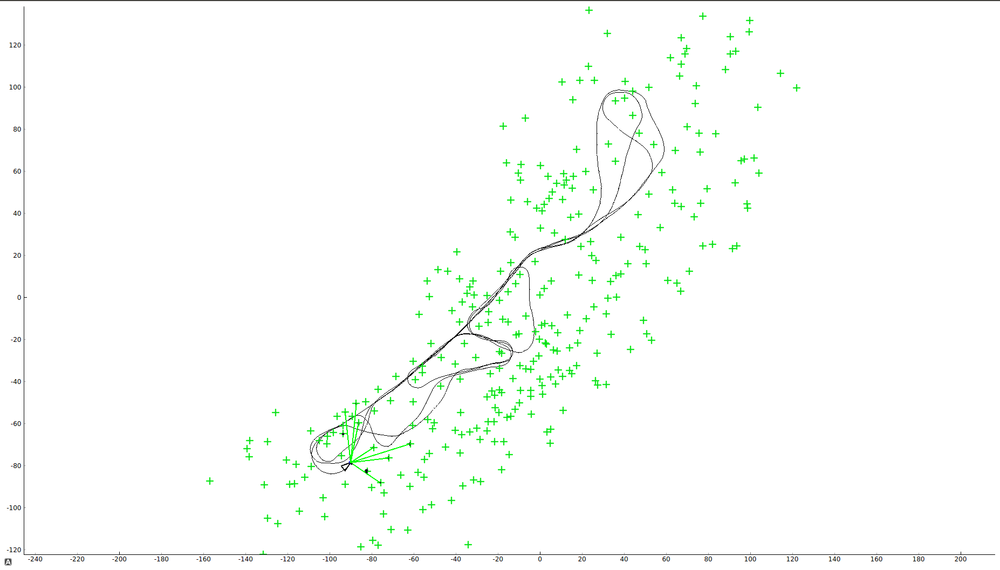

Code for implementing on EKF-SLAM on the Victoria Park Dataset.

1) data folder has the sensor data from wheel encoder odometry, GPS and LASER
2) You can simply run slam.py to see the SLAM algorithm running live on the dataset
3) The triangle is the car and green lines coming out of it are the laser measurements and the green stars are the Landmarks(trees) in the map created.
4) Data association is done (for determining whether a measurement is a new or an existing landmark) by solving a heuristic cost matrix where Mahalanobis distance is used as a metric in this approach. 

